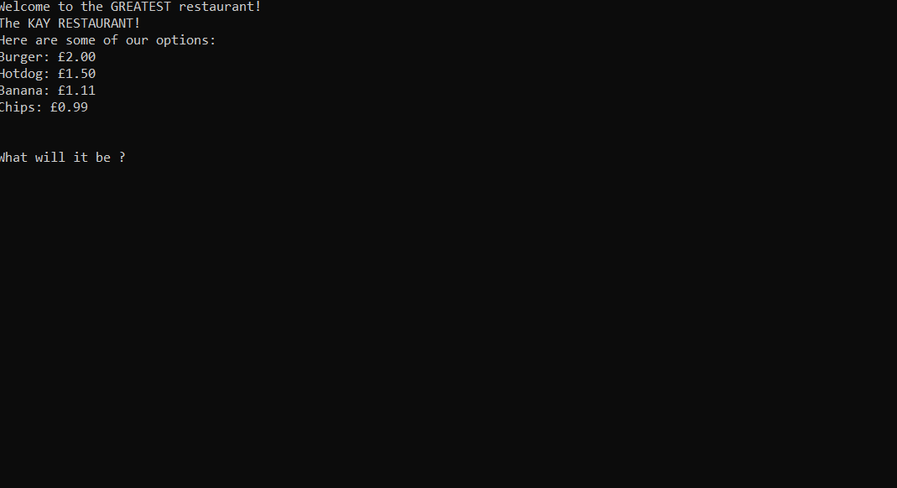
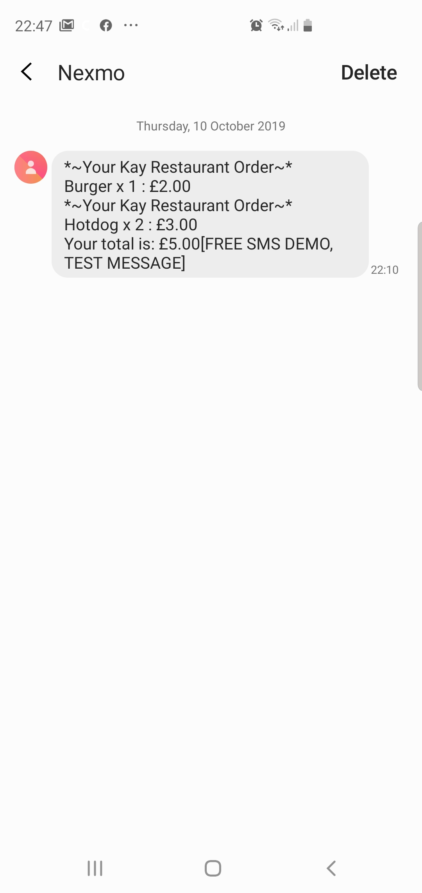

# KayRestaurantCSharp

This app allows a user to create an order to the "Kay Restaurant" from their console and it uses the Nexmo API to send them a text-receipt to their mobile phone.





```sh
$ git clone this repo
$ open Visual Studio 2019 and open the repo
$ Press F5 or Start to open the application
